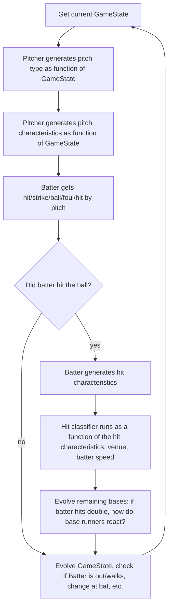

MLB Game Simulator
==============================

Simulate MLB matchup results

Link to documentation: [documentation](https://reecetec.github.io/mlb_simulator/)
 - not exhaustive as of now

Todo:
 - Update doc string format to format seen in data_utils.py
 - finish documenting functions in mlb_simulator/models/
 - write improved pitch characteristic generation model - currently not conditioned on game state
    - more balls will be thrown if count is 0-2 for ex, but not currently a factor
 - re-implement classes for simulation cleanly and using better practices
 - Fix game state transition probabilities edge cases and add script to update this monthly
 - Implement simulation logic from notebook 7.0 in simulation class
    - also refactor this
 - add logic to track simulation box scores
 - build dashboard to display games being played today, and allow user to run simulation for a desired game from the dash (and view results, box score)
     - try creating custom react component to display each game in desired format

## Getting Started

1. Clone the repo
2. Install the requirements.txt (in a conda env or venv), and then run the following in the project root to create sqlite db
```sh
make data
```
* Note: This downloads Statcast data from 2018. It will take a while.
* Sometimes pybaseball will run into an error, if so, rerun above command to continue setup
* The database will be located at ~/sports/mlb_simulator/data/databases/mlb.db. 

Once the database has been set up:

```sh
pip install .
```

## Usage

mlb_simulator/simulation contains objects which interact to simulate an entire baseball 
game. The flow is as follows:




Project Organization
------------

    ├── LICENSE
    ├── Makefile           <- Makefile with commands like `make data` or `make train`
    ├── README.md          <- The top-level README for developers using this project.
    ├── data
    │   ├── external       <- Data from third party sources.
    │   ├── interim        <- Intermediate data that has been transformed.
    │   ├── processed      <- The final, canonical data sets for modeling.
    │   └── raw            <- The original, immutable data dump.
    │
    ├── docs               <- A default Sphinx project; see sphinx-doc.org for details
    │
    ├── models             <- Trained and serialized models, model predictions, or model summaries
    │
    ├── notebooks          <- Jupyter notebooks. Naming convention is a number (for ordering),
    │                         the creator's initials, and a short `-` delimited description, e.g.
    │                         `1.0-jqp-initial-data-exploration`.
    │
    ├── references         <- Data dictionaries, manuals, and all other explanatory materials.
    │
    ├── reports            <- Generated analysis as HTML, PDF, LaTeX, etc.
    │   └── figures        <- Generated graphics and figures to be used in reporting
    │
    ├── requirements.txt   <- The requirements file for reproducing the analysis environment, e.g.
    │                         generated with `pip freeze > requirements.txt`
    │
    ├── setup.py           <- makes project pip installable (pip install -e .) so src can be imported
    ├── mlb_simulator      <- Source code for use in this project.
    │   ├── __init__.py    <- Makes src a Python module
    │   │
    │   ├── data           <- Scripts to download or generate data
    │   │   └── make_dataset.py
    │   │
    │   ├── features       <- Scripts to turn raw data into features for modeling
    │   │   └── build_features.py
    │   │
    │   ├── models         <- Scripts to train models and then use trained models to make
    │   │   │                 predictions
    │   │   ├── predict_model.py
    │   │   └── train_model.py
    │   │
    │   └── visualization  <- Scripts to create exploratory and results oriented visualizations
    │       └── visualize.py
    │
    └── tox.ini            <- tox file with settings for running tox; see tox.readthedocs.io


--------

<p><small>Project based on the <a target="_blank" href="https://drivendata.github.io/cookiecutter-data-science/">cookiecutter data science project template</a>. #cookiecutterdatascience</small></p>
